# F Heena Boutique 👗

A front-end e-commerce web application for a fashion boutique, offering curated ethnic wear with **buy or rent** options. Built entirely with vanilla HTML, CSS, and JavaScript, using the browser's `localStorage` as a lightweight data layer for users, products, cart, and orders.

> ⚠️ **Note:** This is a static front-end prototype with no backend/server. All data (users, products, cart, orders) is stored in the browser's `localStorage` and will reset if browser storage is cleared. There is no real authentication, database, or payment processing.

---

## 📋 Table of Contents

- [Project Description](#project-description)
- [Features](#features)
- [Screenshots](#screenshots)
- [Tech Stack](#tech-stack)
- [Project Structure](#project-structure)
- [Prerequisites](#prerequisites)
- [Setup Instructions](#setup-instructions)
- [Running the Project](#running-the-project)
- [Usage Guide](#usage-guide)
- [Configuration](#configuration)
- [Folder Structure Explanation](#folder-structure-explanation)
- [Key Functionalities](#key-functionalities)
- [Dependencies](#dependencies)
- [Environment Variables](#environment-variables)
- [Known Limitations](#known-limitations)
- [Future Improvements](#future-improvements)
- [Contributing](#contributing)
- [License](#license)
- [Author](#author)

---

## Project Description

**F Heena Boutique** is a static, multi-page website for a fashion boutique that sells and rents ethnic wear (lehengas, sarees, bridal outfits, etc.). The site includes:

- A public storefront (home page, product listing, contact form)
- User registration and login
- A shopping cart where logged-in users can buy or rent products
- An admin panel (separate login) to manage products and approve/reject customer orders

All persistence is handled client-side via the browser's `localStorage` API — there is no server, database, or API integration in the current codebase.

---

## Features

- 🏠 **Home Page** — Hero banner, best-selling product highlights, "Why Choose Us" section, and a contact form
- 🛍️ **Product Listing** — Dynamically rendered product grid (pulled from `localStorage`)
- 🛒 **Shopping Cart** — Add products to cart, then **Buy** or **Rent** them; remove items from the cart
- 👤 **User Accounts** — Sign up and log in as a regular customer (stored in `localStorage`)
- 🔐 **Admin Panel** — Separate hardcoded admin login to:
  - Add and delete products
  - View and manage customer orders (Accept / Reject)
- 📱 **Responsive Navigation** — Collapsible sidebar/hamburger menu for mobile screens
- ✅ **Login State Awareness** — Nav bar shows "Login" or "Logout" depending on session state

---

## Screenshots

### 🏠 Home Page
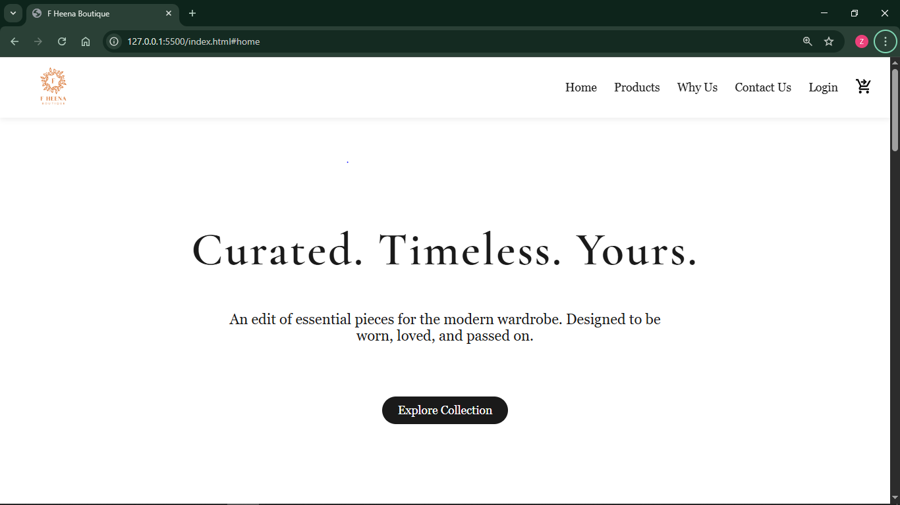
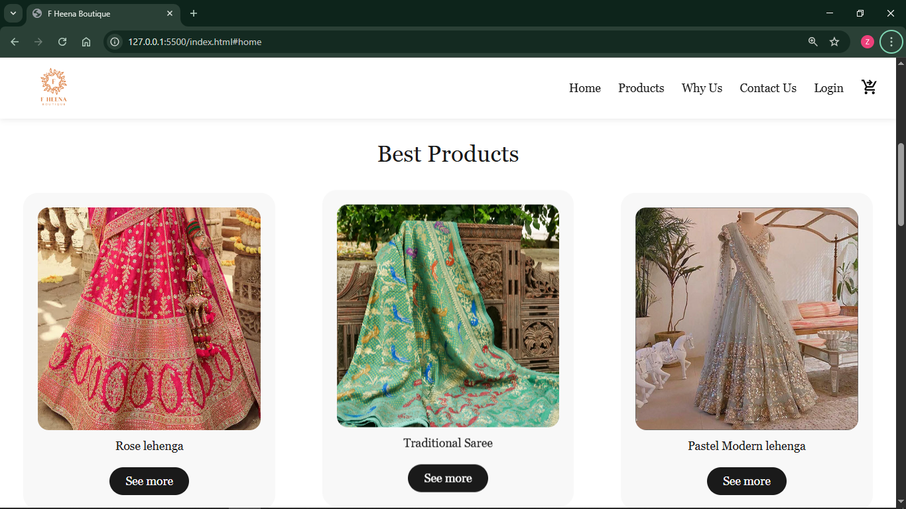

### ✨ Why Choose Us
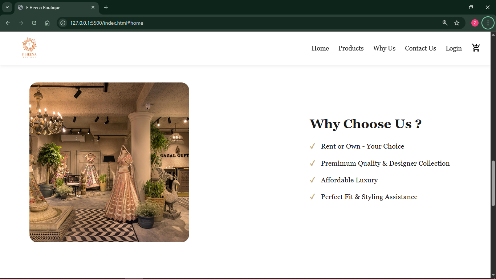

### 📞 Contact Us
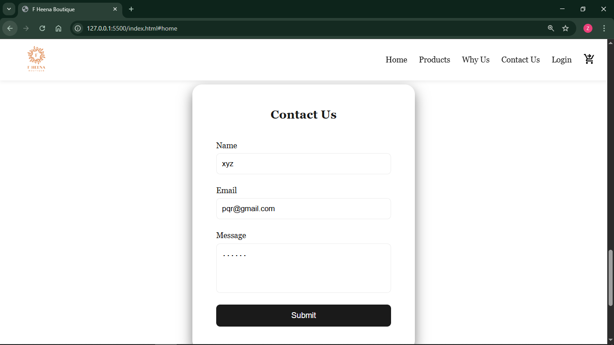

### 🛍️ Products Page
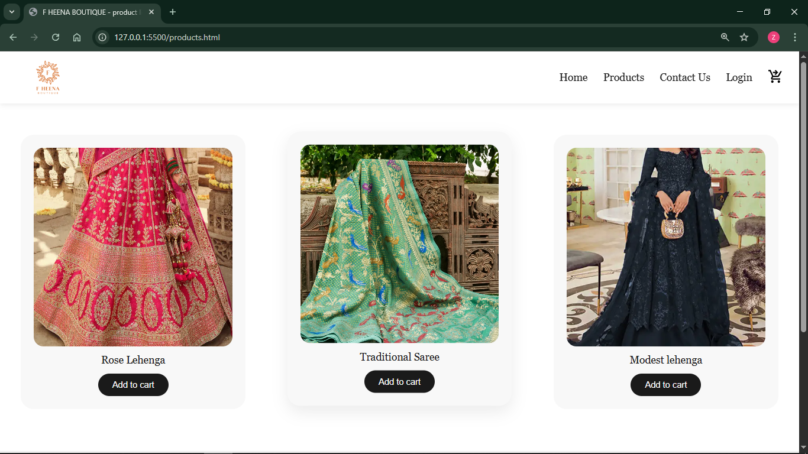

### 🛒 Cart Page
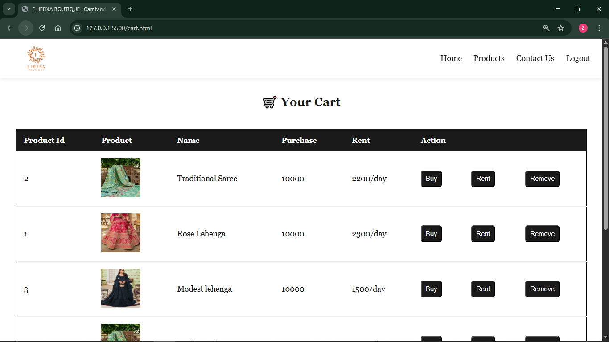

### 👤 User Login
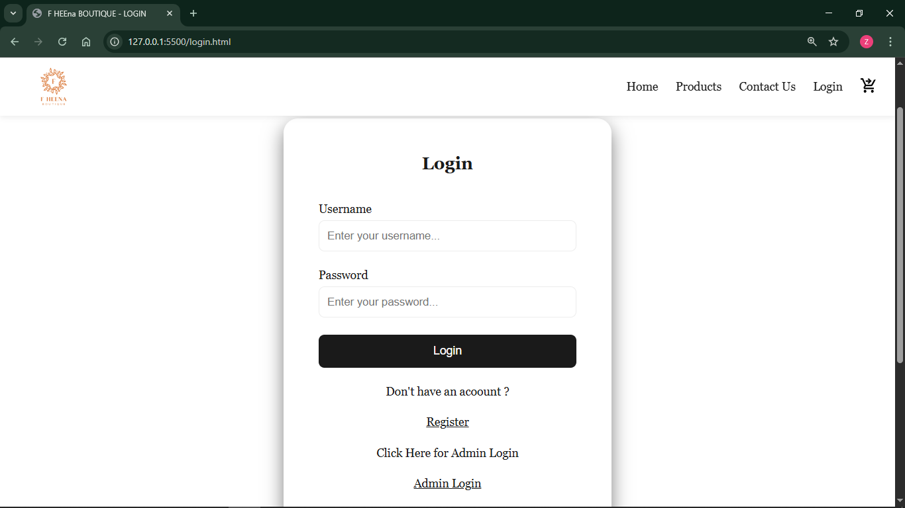

### 📝 User Registration
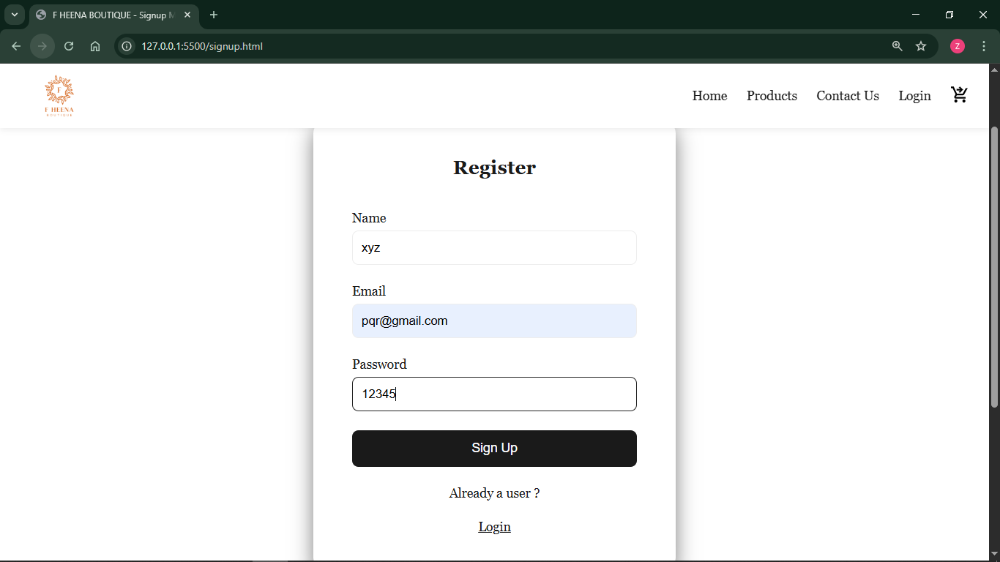

### 🔐 Admin Login
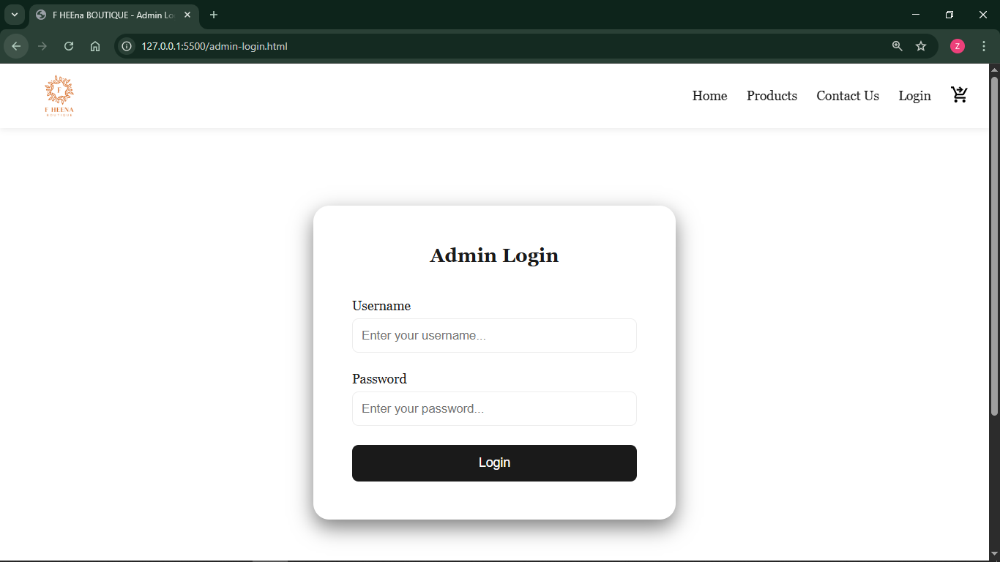

### 🖥️ Admin Home
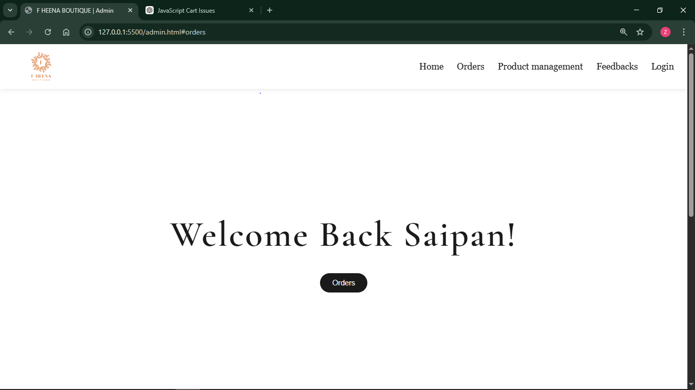

### 📦 Admin Order Management
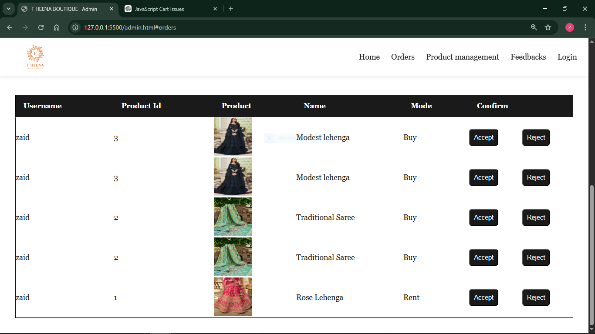

---

## Tech Stack

| Category         | Technology                          |
|-------------------|--------------------------------------|
| Markup            | HTML5                                |
| Styling           | CSS3 (custom, no framework)          |
| Fonts             | Google Fonts — Cormorant Garamond, Inter |
| Scripting         | Vanilla JavaScript (ES6+)            |
| Data Storage      | Browser `localStorage`               |
| Build Tools       | None (no bundler/package manager configured) |

No frameworks (React/Vue/Angular), no CSS preprocessors, and no `package.json` were found in the uploaded files — this is a plain static site.

---

## Project Structure

Based on the uploaded files, here is the inferred project structure (paths referenced by the HTML/CSS files, such as `css/style.css`, `JS/main.js`, and `images/...`, are shown even though only the source files themselves were uploaded):

```
f-heena-boutique/
├── index.html            # Home page (hero, best products, why-us, contact form)
├── login.html             # Customer login page
├── signup.html             # Customer registration page
├── admin-login.html        # Admin login page
├── admin.html               # Admin dashboard (orders + product management)
├── products.html             # Product listing page
├── cart.html                  # Shopping cart page
├── navbar.html                 # Standalone/reusable navbar markup (not linked via include)
├── css/
│   └── style.css                # Global stylesheet
├── JS/
│   └── main.js                    # All application logic (auth, cart, orders, admin)
└── images/                          # Referenced image assets (logo, product photos, etc.)
    ├── logo.png
    ├── rose_lehenga.jpg
    ├── saree.png
    ├── lehenga1.png
    ├── lehenga2.png
    ├── modest_lehenga.jpg
    ├── royal_wed.jpg
    └── photo.jpg
```


## Prerequisites

Since this is a static HTML/CSS/JS project with no build step, you only need:

- A modern web browser (Chrome, Firefox, Edge, Safari)
- Optionally, a simple local web server for the best experience (recommended because `localStorage` and relative asset paths behave more consistently over `http://` than `file://`)

No Node.js, npm, or other package managers are required to run the project as-is.

---

## Setup Instructions

1. **Clone or download** the project files into a single folder.
2. Recreate the folder structure expected by the HTML files:
   ```
   your-project/
   ├── index.html, login.html, signup.html, admin.html, admin-login.html, products.html, cart.html, navbar.html
   ├── css/style.css
   ├── JS/main.js
   └── images/  (add your logo and product images here)
   ```
3. Make sure file/folder names match the casing used in the HTML (`css/style.css` and `JS/main.js` — note the capital `JS`).

---

## Running the Project

### Option 1 — Open directly in a browser
Simply double-click `index.html`, or open it via your browser's "Open File" dialog.

### Option 2 — Serve locally (recommended)

Using Python:
```bash
python3 -m http.server 8000
```
Then visit `http://localhost:8000` in your browser.

Using Node.js (`npx serve`):
```bash
npx serve .
```

Using VS Code:
Install the **Live Server** extension and click "Go Live" from `index.html`.

---

## Usage Guide

### As a customer
1. Go to **Sign Up** (`signup.html`) and register with a name, email, and password.
2. Log in via **Login** (`login.html`) using the same credentials.
3. Browse the **Products** page and click **Add to cart** on any item.
4. Visit the **Cart** page and choose **Buy** or **Rent** for each item, or **Remove** it from the cart.
5. Orders placed will show a status of `Pending` until an admin accepts or rejects them.

### As an admin
1. Go to **Login → Click Here for Admin Login**, or navigate directly to `admin-login.html`.
2. Log in with the hardcoded admin credentials (see [Configuration](#configuration) below).
3. From the **Admin Dashboard** (`admin.html`) you can:
   - View and manage customer **Orders** (Accept/Reject)
   - Add new products (title, price, rent-per-day, image path) under **Product Management**
   - Delete existing products

---

## Configuration

The admin login credentials are **hardcoded** in `JS/main.js` and are not configurable via environment variables:

```js
if (!(adminUsername === "admin" && adminPassword === "12345")) {
  // invalid
}
```

| Field    | Value   |
|----------|---------|
| Username | `admin` |
| Password | `12345` |

> 🔒 **Security Warning:** These credentials are stored in plain text on the client side and are visible to anyone who views the page source. This is **not secure** and should never be used in a production environment. See [Known Limitations](#known-limitations).

---

## Folder Structure Explanation

| Path/File            | Purpose |
|------------------------|---------|
| `index.html`            | Landing page with hero section, featured products, "Why Us", and contact form |
| `products.html`          | Renders the full product catalog dynamically from `localStorage` |
| `cart.html`                | Displays items added to the logged-in user's cart with Buy/Rent/Remove actions |
| `login.html`                 | Customer login form; links to Sign Up and Admin Login |
| `signup.html`                  | Customer registration form |
| `admin-login.html`               | Separate login form for admin access |
| `admin.html`                       | Admin dashboard: order management + product management |
| `navbar.html`                        | A standalone copy of the site navigation markup (appears to be a reference/reusable snippet, not dynamically included by any page) |
| `css/style.css`                       | All styling for the site: layout, navbar, forms, tables, responsive rules |
| `JS/main.js`                            | All client-side logic: authentication, product rendering, cart, orders, admin CRUD |
| `images/`                                 | Static image assets referenced by the HTML (logo, product photos) — not included in upload |

---

## Key Functionalities

All logic lives in a single file, `JS/main.js`, and is driven entirely by `localStorage`:

| Functionality        | Description |
|------------------------|-------------|
| **User Registration**    | Saves new users to the `users` array in `localStorage` |
| **User Login**             | Validates credentials against stored `users`; saves the active session as `loggedInUser` |
| **Admin Login**               | Validates against hardcoded `admin` / `12345` credentials, then redirects to `admin.html` |
| **Login/Logout Nav Link**       | Nav bar dynamically toggles between "Login" and "Logout" based on session state |
| **Product Rendering**             | Reads the `products` array from `localStorage` and renders product cards on the Products page |
| **Add to Cart**                     | Requires login; appends the product (tagged with the current username) to the `cart` array |
| **Cart Rendering**                    | Filters cart items belonging to the logged-in user and displays Buy/Rent/Remove actions, or the current order status if one exists |
| **Buy / Rent**                          | Creates a new order object (with a unique `orderId`, `mode: "Buy"` or `"Rent"`, and `status: "Pending"`) and saves it to the `orders` array |
| **Admin — Product Management**            | Add new products (with auto-incremented `productId`) and delete existing ones |
| **Admin — Order Management**                | Lists all orders and lets the admin **Accept** (`Order Confirmed`) or **Reject** them |

### `localStorage` Keys Used

| Key            | Description |
|------------------|-------------|
| `users`            | Array of registered customer accounts (`{ name, email, password }`) |
| `loggedInUser`       | The currently logged-in customer's data |
| `products`             | Array of products managed via the admin panel |
| `cart`                   | Array of items added to any user's cart (filtered by username) |
| `orders`                   | Array of placed orders (buy/rent requests and their status) |

---

## Dependencies

This project has **no npm/yarn dependencies** and no `package.json`. The only external resource used is:

- **Google Fonts** (loaded via `@import` in `style.css`):
  - `Cormorant Garamond` (weights 300–600)
  - `Inter` (weights 300–500)

No JavaScript libraries or frameworks are used.

---

## API Information

This project does **not** integrate with any external API. All "backend" behavior (accounts, products, cart, orders) is simulated using `localStorage` in `JS/main.js`.

---

## Environment Variables

None required. This is a purely static, client-side project with no build configuration or `.env` file.

---

## Known Limitations

- **No real backend or database** — all data lives in the browser's `localStorage` and is lost if the browser cache/storage is cleared, and is not shared across devices or browsers.
- **Insecure authentication** — passwords (including the admin password) are stored and compared in plain text on the client side; this is not suitable for production use.
- **No password hashing or session tokens** — anyone with basic dev-tools access can view stored credentials.
- **No server-side validation** — all form validation is basic HTML5 `required` attributes plus simple JS checks.
- **`navbar.html` is not actually included/reused** by other pages — each HTML page duplicates the navbar markup instead of importing this file.
- **Referenced assets not included** — the `images/` folder and its contents (logo, product photos) are referenced in the HTML but were not part of the uploaded files.
- **No payment gateway** — "Buy" and "Rent" actions only create a `Pending` order record; there is no actual checkout or payment processing.
- **No routing/framework** — page navigation relies on standard multi-page HTML links (`<a href="...">`), not a JS router.

---

## Future Improvements

- Replace `localStorage` with a real backend (e.g., Node.js/Express + a database) and REST/GraphQL API
- Implement secure authentication (hashed passwords, sessions/JWT) and remove the hardcoded admin credentials
- Add real payment gateway integration for the "Buy" flow
- Convert the duplicated navbar markup into a single reusable component/include
- Add client-side or server-side form validation and error handling
- Add product image uploads instead of manually entering an image path
- Add pagination/search/filtering to the Products page
- Add unit/integration tests
- Introduce a bundler (Vite/Webpack) and a `package.json` for dependency management

---

## Contributing

Contributions are welcome! To contribute:

1. Fork the repository
2. Create a new branch (`git checkout -b feature/your-feature`)
3. Commit your changes (`git commit -m "Add your feature"`)
4. Push to your branch (`git push origin feature/your-feature`)
5. Open a Pull Request

Please open an issue first to discuss any significant changes.

---

## Author

**F Heena Boutique**
Author Name : Zaid Inamdar
📧 Contact: [hello@fheenaboutique.com](mailto:inamdarzaid587@gmail.com)


